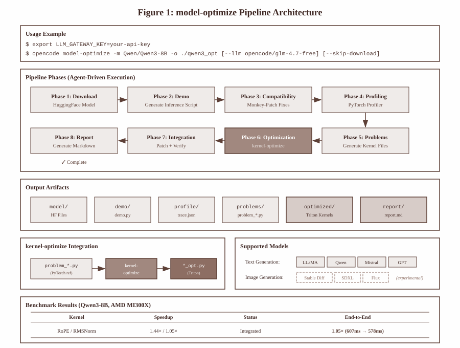

# Model Optimize - Design Document

## Overview

`model-optimize` is an end-to-end HuggingFace model optimization pipeline that automates the process of downloading, profiling, and optimizing deep learning models for maximum inference performance on AMD GPUs.

## Architecture

### High-Level Architecture

```
┌─────────────────────────────────────────────────────────────────────────────┐
│                           opencode model-optimize                            │
├─────────────────────────────────────────────────────────────────────────────┤
│                                                                             │
│  ┌─────────────┐   ┌─────────────┐   ┌─────────────┐   ┌─────────────┐    │
│  │   Phase 1   │ → │   Phase 2   │ → │   Phase 3   │ → │   Phase 4   │    │
│  │  Download   │   │    Demo     │   │ Compat Fix  │   │  Profiling  │    │
│  └─────────────┘   └─────────────┘   └─────────────┘   └─────────────┘    │
│         │                                                     │             │
│         ↓                                                     ↓             │
│  ┌─────────────┐   ┌─────────────┐   ┌─────────────┐   ┌─────────────┐    │
│  │   Phase 8   │ ← │   Phase 7   │ ← │   Phase 6   │ ← │   Phase 5   │    │
│  │   Report    │   │ Integration │   │kernel-optim │   │  Problems   │    │
│  └─────────────┘   └─────────────┘   └─────────────┘   └─────────────┘    │
│                                                                             │
└─────────────────────────────────────────────────────────────────────────────┘
```

### Component Architecture

<div align="center">
  
</div>

## Pipeline Phases

### Phase 1: Model Download
- Downloads HuggingFace model using `huggingface_hub` or `transformers`
- Supports `--skip-download` flag if model already exists
- Validates model files and configuration

### Phase 2: Demo Generation
- Detects model type from `config.json` (text-generation, text2image, etc.)
- Generates appropriate demo script based on model architecture
- Supports LLaMA, Qwen, Stable Diffusion, and other popular architectures

### Phase 3: Compatibility Fix
- Runs demo script and captures errors
- Applies monkey-patches for compatibility issues
- Creates patches in `demo/patches/` directory
- Never modifies system libraries

### Phase 4: Performance Profiling
- Uses PyTorch Profiler with CUDA activity tracing
- Optionally uses AMD ROCm profiler (`rocprof`)
- Generates:
  - `trace.json` - Chrome trace for visualization
  - `bottlenecks.json` - Top operators by CUDA time
  - `operator_summary.txt` - Detailed profiler output

### Phase 5: Problem Generation
- Converts bottleneck operators to Problem files
- Each Problem file contains:
  - `Model` class with PyTorch reference implementation
  - `get_inputs()` function with realistic input shapes
  - `get_init_inputs()` for model initialization

### Phase 6: Kernel Optimization
- Calls `opencode kernel-optimize` for each Problem file
- Generates optimized Triton kernels
- Tracks speedup for each kernel
- Only integrates kernels with speedup > 1.0x

### Phase 7: Integration
- Creates `integrate.py` with monkey-patches
- Replaces slow operators with optimized Triton kernels
- Tests correctness (max logits difference < 0.1)
- Benchmarks end-to-end performance

### Phase 8: Report Generation
- Generates comprehensive Markdown report
- Includes:
  - Model architecture details
  - Bottleneck analysis table
  - Optimization results per kernel
  - Integration details
  - Recommendations for further optimization

## Directory Structure

```
output_dir/
├── config.json              # Project configuration
├── progress.json            # Progress tracking (updated by agent)
├── model/                   # Downloaded HuggingFace model
│   ├── config.json
│   ├── tokenizer.json
│   └── *.safetensors
├── demo/                    # Demo scripts
│   ├── demo.py              # Working inference script
│   └── patches/             # Compatibility monkey-patches
├── profile/                 # Profiling results
│   ├── trace.json           # Chrome trace
│   ├── bottlenecks.json     # Bottleneck analysis
│   └── operator_summary.txt
├── problems/                # Kernel optimization problems
│   ├── problem_linear.py
│   ├── problem_linear_opt.py
│   ├── problem_rmsnorm.py
│   ├── problem_rmsnorm_opt.py
│   └── ...
├── optimized/               # Production-ready kernels
│   ├── integrate.py         # Model patching script
│   ├── test_integration.py  # Integration test
│   └── problem_*_opt.py     # Optimized kernels
└── report/                  # Final report
    ├── optimization_report.md
    └── integration_results.json
```

## Agent Orchestration

The CLI creates a temporary `.opencode/` directory with:
- `opencode.jsonc` - Configuration for LLM provider
- `agent/model-opt.md` - Agent instructions

The agent (Claude/GPT) executes the 8 phases sequentially, using:
- Python scripts for model loading, profiling, testing
- Bash commands for file operations
- `opencode kernel-optimize` for kernel optimization

## Key Design Decisions

### 1. Agent-Driven Architecture
- Uses LLM agent to handle diverse model architectures
- Adapts to unexpected errors and compatibility issues
- Generates custom code for each model type

### 2. Monkey-Patching Integration
- Never modifies installed packages
- All optimizations applied at runtime
- Easy to enable/disable specific optimizations

### 3. Problem File Format
- Compatible with `kernel-optimize` tool
- Standardized interface (`Model`, `get_inputs()`, `get_init_inputs()`)
- Enables isolated kernel benchmarking

### 4. Progressive Optimization
- Only integrates kernels with positive speedup
- Falls back to PyTorch for non-optimizable operators
- Validates correctness before performance

## Dependencies

- `huggingface_hub` - Model download
- `transformers` - Model loading
- `torch` - PyTorch with CUDA support
- `triton` - Kernel development
- `opencode` - kernel-optimize tool

## Limitations

1. **Single GPU**: Current implementation targets single-GPU optimization
2. **AMD-Specific Tuning**: Kernels tuned for AMD MI300X, may need adjustment for other GPUs
3. **Dynamic Shapes**: Autotuned kernels may need recompilation for different sequence lengths
4. **Memory-Bound Operations**: Some operations (copy, cat, add) cannot be significantly optimized

